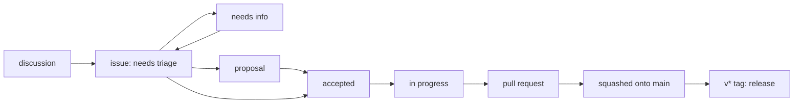

# Contributing

Thanks for looking. stickypane is at the design stage with one maintainer:
how the board behaves still changes when I see it used. So the most useful
thing is often not code but a report of what you expected.

- [Ways to help](#ways-to-help)
- [From an idea to a release](#from-an-idea-to-a-release)
- [Opening an issue](#opening-an-issue)
- [Proposing a change](#proposing-a-change)
- [Taking an issue](#taking-an-issue)
- [Setting up](#setting-up)
- [Making the change](#making-the-change)
- [The pull request](#the-pull-request)
- [With an AI agent](#with-an-ai-agent)

## Ways to help

| You have | Do this |
| --- | --- |
| a question, or an idea not yet thought through | start a [discussion](https://github.com/LeeSwallow/stickypane/discussions) |
| used it for a day and something felt wrong | a [design feedback](https://github.com/LeeSwallow/stickypane/issues/new?template=design_feedback.yml) issue: what you expected the board to show |
| something broken | a [bug report](https://github.com/LeeSwallow/stickypane/issues/new?template=bug.yml) |
| a small thing the board should do | a [feature request](https://github.com/LeeSwallow/stickypane/issues/new?template=feature.yml) |
| a change to how it behaves, a new shape or command | a [proposal](https://github.com/LeeSwallow/stickypane/issues/new?template=proposal.yml) |
| time to build something | an issue labelled [accepted](https://github.com/LeeSwallow/stickypane/labels/accepted), or a [good first issue](https://github.com/LeeSwallow/stickypane/labels/good%20first%20issue) |
| a language | a translation: one JSON file, see [docs/translating.md](docs/translating.md) |
| a security problem | report it privately: [SECURITY.md](SECURITY.md) |

## From an idea to a release

Everyone goes through the same steps, the maintainer included. The labels
say where an issue is:



| Label | Means | Who moves it on |
| --- | --- | --- |
| `needs triage` | new; every issue starts here | the maintainer, within a week |
| `needs info` | a question is waiting for the person who opened it | the reporter, by answering |
| `proposal` | a bigger change, discussed before it is built | everyone discusses; the maintainer decides |
| `accepted` | agreed and ready; anyone may build it | whoever takes it |
| `in progress` | someone has it; see the assignee | the assignee, by opening a pull request |
| `wontfix`, `duplicate` | closed, with a reason in a comment | |

## Opening an issue

Use a template: blank issues are off, so that each issue says what is
needed to act on it. Search first; a thumbs-up on an existing issue counts.
One issue is one thing. A bug report needs `stickypane version`, the
terminal and OS, and what you saw; a pasted screen is worth more than a
description of it.

## Proposing a change

A change to the file formats, the keys, the commands, the agent guide or
how the screen is shared starts as a proposal, as in
[Go's proposal process](https://github.com/golang/proposal): the problem
with a real case, what you propose, the alternatives, and what it changes.
It is discussed in the issue. It ends with `accepted`, with a comment saying
what was agreed, or closed with the reason. The yardstick is
[VISION.md](VISION.md): no setup, plain files, any terminal, any agent.

Bug fixes, docs and small additions that change no format need no
proposal.

## Taking an issue

1. Pick an issue labelled `accepted`, or one you opened.
2. Comment that you are taking it. The maintainer assigns you and labels it
   `in progress`. Do not wait for that to start, but do say so: it keeps
   two people from building the same thing.
3. Open a draft pull request early if you want feedback on the direction.
4. An assigned issue with no word for two weeks is free again. Say so if
   you need longer; that is fine.

## Setting up

You need Go (the version in `go.mod`, 1.26 or later), git, and a terminal.
tmux, WezTerm, Zellij or Windows Terminal is handy for running the board
next to a shell, but not required.

```sh
git clone https://github.com/LeeSwallow/stickypane
cd stickypane
git config core.hooksPath .githooks   # once: commit checks, see below
go build -o stickypane ./cmd/stickypane
./stickypane                          # the board of this repository
```

Checks, as CI runs them:

```sh
go vet ./...
go test -race ./...                   # the tests are the specification
gofmt -l .                            # prints nothing when all is formatted
sh scripts/selfcheck.sh               # the plugin's files
sh scripts/licenses.sh                # the licenses of the linked modules
go test ./internal/store ./internal/app -run XXX -bench .   # before and after a change to loading or drawing
```

Where things are: [docs/architecture.md](docs/architecture.md) (the layers,
how a note is read and written, how to add a shape) and
[docs/plugin.md](docs/plugin.md) (the skills, commands and hooks). A package
may only import a lower layer; `internal/layers` fails the tests otherwise.

## Making the change

- **Branch** from the latest `main`: `scripts/issue.sh 12` makes
  `fix/12-short-title`, named by the issue's kind.
- **Commits** are [Conventional Commits](https://www.conventionalcommits.org/):
  `feat: ...`, `fix: ...`, `docs: ...`, `refactor: ...`, `chore: ...`, a
  `!` for a breaking change. With the hooks on, every commit on the branch
  gets `Refs: #12`.
- **Tests** come with the change. When a test and the README disagree, say
  so in the pull request.
- **Docs**: a change in behaviour updates the README, and the agent guide
  (`internal/initcmd/guide.md`) or a skill when agents need to know.
- Go, standard library first. A new dependency needs a reason in the pull
  request, and a license `scripts/licenses.sh` accepts.

## The pull request

`scripts/pr.sh` pushes the branch and opens the pull request with
`Closes #12` and the issue's kind label. CI checks:

- the tests on Linux, macOS and Windows, `go vet`, and formatting;
- the title is a Conventional Commit, written as a release-note line,
  because it becomes the commit on `main`;
- the body closes an issue, or the pull request has the `no-issue` label
  (for a typo or a small fix);
- one kind label: `feature`, `enhancement`, `bug`, `breaking change`,
  `docs`, `plugin` or `chore`; it puts the change in the right part of the
  release notes;
- no commit names an AI tool as an author.

The maintainer reviews within a week or says when. A pull request is
squashed onto `main`, so its title is what the history and the release
notes say. A `v*` tag builds a release from `main`.

## With an AI agent

stickypane is made for working with agents, and contributions written with
one are welcome. Read the diff yourself before you open the pull request,
and say in it what you checked. [AGENTS.md](AGENTS.md) is what an agent
reads before changing this repository.

You are the author of what you commit, so a commit does not list an AI tool
as a co-author or say it was generated by one. Agents add such lines by
default; the commit-msg hook (`git config core.hooksPath .githooks`) takes
them out and leaves human co-authors alone, and CI checks every pull
request. This follows the Linux kernel and the Apache projects: the person
signs, the tool does not.

## Not code

The skills (`skills/`), the agent guide and the README are where most of
the product is. Wording that makes an agent do the right thing more often
is a contribution. The design notes are in `docs/superpowers/specs/`; a
change that contradicts one should say why.

By contributing you agree that your contribution is licensed under the
project's [MIT license](LICENSE), and to follow the
[Code of Conduct](CODE_OF_CONDUCT.md).
