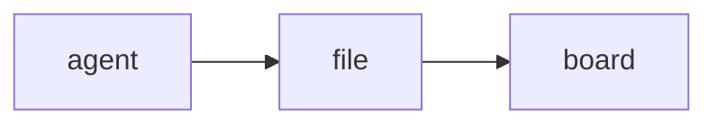

# stickypane

A note board in your terminal, for you and your coding agent.

```
 ● ▦ Auth work  ● ☑ Login API  ● ≣ Work log  ○ ✎ Auth design  ○ ✎ memo
──────────────────────────────────────────────────────────────────────────────
╔ ▦ Auth work ══════════════════════════════════════════════════════ 4 cards ╗
║ To do (1)               Doing (1)               Done (2)                   ║
║ ──────────────────────  ──────────────────────  ──────────────────────     ║
║ ▎ payments              › login API             ▎ schema                   ║
║                             refresh tokens                                 ║
║                             come later          ▎ CI setup                 ║
╚════════════════════════════════════════════════════════════════════════════╝
╭ ☑ Login API ─────────────────── 2/3 ╮╭ ≣ Work log ──────────────── 2 lines ╮
│ ▓▓▓▓▓▓▓▓▓▓▓▓▓░░░░░░░ 2/3            ││ 14:02 tests passed                  │
│                                     ││ 14:10 started on review feedback    │
│   ☑ Add endpoint                    │╰─────────────────────────────────────╯
│   ☑ Validate input                  │
│   ☐ Write tests                     │
╰─────────────────────────────────────╯
h l j k move  H L shift card  J K reorder  n new card  enter zoom  o close
```

Your agent jots things down as plain Markdown files. stickypane shows them in
a pane next to it: plain notes, kanban boards, checklists, logs, charts,
Mermaid diagrams, and forms you answer with a key press. The line
at the top lists every note (`●` open, `○` folded away); the ones you open are
drawn below it in full, never cut. Move a card or tick a box and the change lands in the same file,
so the agent sees it too.

- **Nothing to configure.** No config file, no server, no hooks.
- **Any agent.** If it can edit files, it can stick notes: Claude Code, Codex
  and others.
- **Any terminal.** A plain window, tmux, WezTerm, Zellij. stickypane is a
  visualization layer, not a terminal plugin.

## Install

```sh
brew install --cask LeeSwallow/tap/stickypane
# or
go install github.com/LeeSwallow/stickypane/cmd/stickypane@latest
```

macOS and Linux are supported.

## Quick start

```sh
cd your-project
stickypane init    # creates .stickypane/ and tells your agent about it
stickypane         # opens the board
```

`init` adds a short guide to `AGENTS.md` and `CLAUDE.md` (whichever exist; it
creates `AGENTS.md` if neither does), so your agent knows the board is there.
Then ask it for anything: "keep a checklist of this refactor on the board",
"explain the structure on the board as a page".

Keep the board next to your agent:

```sh
tmux split-window -h stickypane             # tmux pane
tmux display-popup -E stickypane            # tmux popup
wezterm cli split-pane --right -- stickypane
```

## Notes are files

One Markdown file in `.stickypane/` is one note. Create a file to stick a
note, edit it to update the note, delete it to take the note down. A one-line
file is a complete note:

```markdown
check env before deploy
```

Front matter says how a note looks. Every key is optional, and you never have
to type one: the keys in the next section change them for you.

| Key     | Values                                                 |
| ------- | ------------------------------------------------------ |
| `type`  | `note` (default), `board`, `checklist`, `log`, `chart`, `form` |
| `title` | shown in the title bar and the note's border            |
| `open`  | `true` draws the note on the screen, `false` folds it away |
| `size`  | `page` (whole width), `half`, `card`                    |
| `rows`  | a fixed height in lines; zoom in to see the rest        |
| `color` | `yellow`, `pink`, `blue`, `green`, `purple`, `orange`   |
| `pin`   | `true` keeps the note first                             |

A note without `open` is folded away, except that a note that appears while
stickypane is running is shown for that run. What your agent just wrote is in
front of you at once, and the file is left alone.

**Board.** Each `## Heading` is a column and each top-level list item is a
card. Indented lines under a card are its details. Any other line under a
column shows up as a card too, and text before the first heading is the
board's description.

```markdown
---
type: board
title: Auth work
open: true
---
## To do
- payments
## Doing
- login API
  - refresh tokens come later
## Done
- schema
```

**Checklist.** `- [ ]` and `- [x]` lines, shown with a progress bar.

**Log.** One entry per line. The note shows the latest ten lines and follows
along as the file grows.

**Chart.** Each `label: number` line is a value; any other line is shown as
text above the chart. `view` picks the drawing: `bar` (default), `spark` for
a one-line trend, or `heat` for a calendar of days when the labels are dates.

```markdown
---
type: chart
title: Tokens per day
view: heat
---
2026-09-28: 41,200
2026-09-29: 8,900
2026-09-30: 0
```

```
app       ████████████████████████ 61        9 10
board     ████████████▏            31   Mon  █ ·
checklist ████████▎                21        ▒ ▓
store     ██████▎                  16   Wed  ·
```

**Diagrams.** A `mermaid` code block in a plain note is drawn as a diagram
instead of being shown as source. Flowcharts (`graph`, `flowchart`), sequence
diagrams and entity-relationship diagrams (`erDiagram`) are drawn; a block
that cannot be drawn keeps its source.

````markdown

````

```
┌───────┐     ┌──────┐     ┌───────┐
│ agent ├────►│ file ├────►│ board │
└───────┘     └──────┘     └───────┘
```

**Form.** A document that asks. Your agent writes the questions; you answer
on the board; the answers land in the same file.

```markdown
---
type: form
title: Deploy now?
open: true
---
The build is green. Where should it go?

## Target
- ( ) staging
  Try it there first.
- ( ) production

## Also
- [ ] run migrations
- [ ] clear the cache

## Note
> 

[ Deploy ] [ Cancel ]
```

```
  ○ staging                      ╭──────────────────────────────╮
      Try it there first.        │ after lunch                  │
› ◉ production                   ╰──────────────────────────────╯
  ☑ run migrations               ┏━━━━━━━━┓ ╭────────╮
  ☐ clear the cache              ┃ Deploy ┃ │ Cancel │
                                 ┗━━━━━━━━┛ ╰────────╯
```

| Line                  | Is                                             |
| --------------------- | ---------------------------------------------- |
| `- ( ) text`          | an option; choosing one clears the others      |
| `- [ ] text`          | an option; choose as many as you like          |
| indented line below   | the option's description                       |
| `> text`              | a line to fill in                              |
| `[ Label ] [ Label ]` | buttons; a form without any gets `[ Submit ]`  |

Everything else is Markdown and is drawn as such. Options of one kind in a
row are one question, named by the heading above it. Pressing a button writes
`submitted: <label>` and `submitted_at` into the front matter; changing an
answer afterwards takes them out again. The agent reads the answers from the
file, or waits for them:

```sh
stickypane wait deploy --timeout 10m
# submitted: Deploy
# at: 2026-10-02T14:03:05+09:00
# Target: production
# Also: run migrations
# Note: after lunch
```

Notes are ordered by file name, pinned ones first. Prefix a number
(`10-plan.md`) to control the order. A file that does not fit its shape is
still shown, never hidden.

## Keys

| Any note            |                         | Open board or checklist |                      |
| ------------------- | ----------------------- | ----------------------- | -------------------- |
| `tab` / `shift+tab` | next, previous note     | `h` `l`                 | change column        |
| `enter`             | open, then zoom         | `j` `k`                 | change card or item  |
| `o`                 | open or close           | `H` `L`                 | move a card sideways |
| `+` / `-`           | bigger, smaller         | `J` `K`                 | reorder a card       |
| `N`                 | jot a note              | `space`                 | tick an item         |
| `a`                 | add by shape            | `n`                     | new card or item     |
| `p` / `c` / `R`     | pin, color, rename      |                         |                      |
| `x` / `D`           | archive, delete         | **Zoomed note**         |                      |
| `e` / `E`           | edit here, in `$EDITOR` | `esc`                   | back                 |
| `r` / `?` / `q`     | reload, help, quit      | `j` `k` `g` `G`         | scroll               |
| `z`                 | zoom                    | **Open form**           |                      |
|                     |                         | `j` `k`                 | change control       |
|                     |                         | `enter` / `space`       | choose, type, press  |

The focused open note takes the keys in the right-hand column where it is;
you do not have to zoom in first. `j`, `k`, `g` and `G` scroll the screen
when the focused note has no cursor of its own. A form uses `enter` itself,
so `z` is the way to zoom into one.

## Editing a note

`e` opens the focused note's file in a small editor that works like vi, so
you can fix a note without leaving the board. `E` hands the file to `$EDITOR`
instead.

| Keys                          | Do                                     |
| ----------------------------- | -------------------------------------- |
| `i` `a` `I` `A` `o` `O`       | insert text; `esc` goes back           |
| `h` `j` `k` `l` `w` `b` `e` `0` `^` `$` `gg` `G` | move                |
| `ctrl+f` `ctrl+b`, `ctrl+d` `ctrl+u` | a page, half a page             |
| `x` `dd` `dw` `D` `cc` `cw` `C` `r` `J` | delete, change, replace, join |
| `yy` `p` `P`, `u` `ctrl+r`    | copy and paste, undo and redo          |
| `/text` `n` `N`, `:12`        | search, go to a line                   |
| `:w` `:q` `:wq` `ZZ` `:q!`    | save, quit, both, quit without saving  |

The border shows the cursor's line and column and which page of the file it
is on. If the file changed on disk while you were editing, usually because
your agent wrote to it, `:w` does not overwrite it: `:w!` does, and `:e!`
loads the file again. Counts (`3dd`) and visual mode are not there.

## Mouse

| Do this                    | And                                             |
| -------------------------- | ----------------------------------------------- |
| click a title in the bar   | a closed note opens, an open one takes the focus, the focused one closes |
| click a note               | it takes the focus                              |
| click an item, option, button or card | it is ticked, chosen, pressed or selected |
| double-click a note        | zoom                                            |
| wheel                      | scroll the screen, or the zoomed note           |

In tmux the mouse reaches stickypane only with `set -g mouse on`.

## Command line and MCP

Editing the files is all an agent needs. For scripts, and for agents that
would rather call a tool, the same notes are reachable two more ways.

```sh
stickypane list --json                       # every note: name, title, type, open, size
stickypane show plan                         # print a note's file
echo "- [ ] build" | stickypane write plan --type checklist --title "Release" --open
stickypane answers deploy                    # what the user answered in a form
stickypane wait deploy --timeout 10m         # the same, once a button is pressed
```

`wait` exits with code 3 when its time runs out. Both take `--json`.

`stickypane mcp` serves the notes over the Model Context Protocol on standard
input and output, with five tools: `list_notes`, `read_note`, `write_note`,
`read_answers` and `guide`.

```sh
claude mcp add stickypane -- stickypane mcp
```

`write` and `write_note` replace the whole note, exactly as overwriting the
file would. Read a note before rewriting it.

## How edits are written

The board never overwrites a file with what it last saw. An edit is an intent
("move this card to that column") applied to the file as it is at that moment,
and the file is then replaced in one step. If your agent changed that card in
the meantime, nothing is written and the board tells you. A note that is a
symlink is edited where it really lives.

Replacing the file has two limits:

- A program that keeps a note open and keeps appending to it
  (`some-command >> .stickypane/log.md`) goes on writing to the old file after
  you edit that note from the board. Writing a line at a time, the way agents
  do, is fine.
- A write that lands in the instant between the board reading a file and
  replacing it is lost.

## Adding a shape

A shape is one package under `internal/widget/` that implements the
`widget.Widget` interface, plus one line in `internal/kinds/kinds.go`.

## License

MIT
