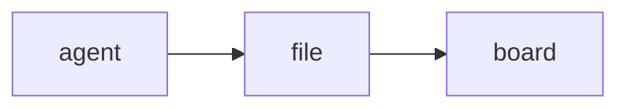

# stickypane

**A board in your terminal that your coding agent writes to and you read.**

```
 ▦ Auth work   ☑ Login API   ≣ build   ▤ Tokens   ◉ Deploy now?   ✎ notes          1/1
╔ ▦ Auth work ═══════════════════════════════════════════════════════════ 4 cards ╗
║ To do (1)               Doing (1)               Done (2)                       ║
║ ─────────────────────   ─────────────────────   ─────────────────────          ║
║ ▎ payments              › login API             ▎ schema                       ║
║                             refresh tokens      ▎ CI setup                     ║
╚═════════════════════════════════════════════════════════════════════════════════╝
╭ ☑ Login API ─────────────── 2/3 ╮╭ ≣ build ──────────────────────── 212 lines ╮
│ ▓▓▓▓▓▓▓▓▓▓▓▓▓░░░░░░░ 2/3        ││ ok   internal/store      0.41s             █
│   ☑ Add endpoint                ││ ok   internal/widget     0.38s             █
│   ☑ Validate input              ││ [exit 0 · 7.15s]                           █
│   ☐ Write tests                 │╰────────────────────────────────────────────╯
╰─────────────────────────────────╯╭ ◉ Deploy now? ─────────────────────── 1/2 ╮
                                   │   ○ staging      ◉ production              │
                                   │ ┏━━━━━━━━┓ ╭────────╮                      │
                                   │ ┃ Deploy ┃ │ Cancel │                      │
h l j k move  H L shift card  n new card  enter zoom  o close  tab next  ? help
```

An agent working in the pane next to you produces a lot of text, and the
things that matter scroll away with it: where the plan stands, what is done,
what it wants you to decide. Chat is the wrong place for that. A board is
the right one.

stickypane is that board. It is a folder of plain files (`.sticky/`), shown
as panes in a terminal window: your agent writes a file, it appears; it
ticks an item, the box ticks; it asks a question, a form with buttons shows
up, you press one, and the agent reads your answer back. You work the board
with keys or the mouse and every change lands in the same files, so the
agent sees what you did without being told.

**What it shows.** Notes in Markdown, kanban boards, checklists, charts,
Mermaid diagrams, forms you answer, logs followed as they grow, shell
scripts with a Run button, and folders as books of pages. Any file of your
project — the README, a log under `logs/` — can be put on the board with one
command.

**What it asks of the agent.** Nothing it does not already know how to do.
Writing a Markdown file is enough; for the rest there are one-line commands
that need no reading first (`stickypane todo plan check tests`,
`stickypane chart tokens add input 1200`, `stickypane show README.md`) and the
same as MCP tools. A 50-line guide, added to `AGENTS.md` or installed as a
skill, tells it all of this.

**What it asks of you.** Nothing to configure: no server, no hooks, no
terminal plugin. It runs in a plain window, in tmux, WezTerm or Zellij, next
to Claude Code, Codex or any agent that can edit files. The files are yours,
in your repository, readable without stickypane.

## Install

```sh
brew install --cask LeeSwallow/tap/stickypane
# or
go install github.com/LeeSwallow/stickypane/cmd/stickypane@latest
```

macOS and Linux are supported.

## Quick start

```sh
cd your-project
stickypane init    # creates .sticky/ and tells your agent about it
stickypane         # opens the board
```

`init` adds a short guide to `AGENTS.md` and `CLAUDE.md` (whichever exist; it
creates `AGENTS.md` if neither does), so your agent knows the board is there.
`init --skill` installs the guide as a Claude Code skill instead
(`.claude/skills/stickypane/SKILL.md`), which is read only when a task calls
for it.
Then ask it for anything: "keep a checklist of this refactor on the board",
"explain the structure on the board as a page".

Keep the board next to your agent:

```sh
tmux split-window -h stickypane             # tmux pane
tmux display-popup -E stickypane            # tmux popup
wezterm cli split-pane --right -- stickypane
```

## The folder is the board

One file in `.sticky/` is one note. Create a file to stick a note, edit it to
update the note, delete it to take the note down. A one-line file is a
complete note:

```markdown
check env before deploy
```

What a file is depends on its name:

| File                    | Is                                                    |
| ----------------------- | ----------------------------------------------------- |
| `*.md`                  | a note; its front matter may give it a shape (below)   |
| `*.log` `*.txt` `*.out` | a log: shown as it is and followed as it grows         |
| `*.sh`                  | a script: shown with a Run button                      |
| a folder                | a book: one note whose pages are the files in it       |
| anything else           | not shown                                              |

```
.sticky/
  10-plan.md          a checklist
  build.log           a log, followed live
  deploy.sh           a script; its output goes to deploy.log
  docs/               one note with three pages
    01-intro.md
    02-usage.md
    03-faq.md
  sticky.json         how you arranged all this
```

**Books.** A folder is shown as one pane that scrolls like one long note:
its files follow one another, each under a rule with its name, and the
border says which page the view is on (`docs · 02-usage  2/3`). `j` `k`, the
wheel and the paging keys scroll through all of it; `,` and `.` jump to the
page before or after; every other key acts on the page the view is on.
Folders are read one level deep. `stickypane link
docs` puts a folder of your project on the board as a book without copying
it, and `stickypane link README.md` does the same for a file; both make a
symbolic link, so what you change on the board is changed in the real file.

**Scripts.** `enter` on a script asks first (`Run deploy.sh in myproject?`),
then runs it with `sh` in the project folder. The output is written to a log
of the same name next to the script, which the board opens and follows while
the script runs. A script never runs without that yes, each time: it is a
file your agent may have written.

**Markdown notes.** Front matter says what a note is. Every key is optional.

| Key     | Values                                                 |
| ------- | ------------------------------------------------------ |
| `type`  | `note` (default), `board`, `checklist`, `log`, `chart`, `form` |
| `title` | shown in the title bar and the note's border            |
| `view`  | for a chart: `bar`, `spark`, `heat`                     |

## sticky.json: how the board is arranged

Where a note is on the screen is not written into the note. It goes to
`.sticky/sticky.json`, which the board writes as you press keys:

```json
{
  "notes": {
    "10-plan.md": { "open": true, "size": "half", "pin": true },
    "build.log": { "title": "CI build", "open": true, "rows": 12 },
    "docs": { "open": true, "color": "blue" }
  },
  "order": ["docs", "10-plan.md", "build.log"],
  "ignore": ["drafts", "*.tmp.md"],
  "theme": "catppuccin-mocha",
  "version": 1
}
```

| Key in `notes` | Values                                        | Key on the board |
| -------------- | --------------------------------------------- | ---------------- |
| `open`         | `true` shows the note, `false` folds it away  | `o`, `enter`     |
| `size`         | `page` (whole width), `half`, `card`          | `+` `-`          |
| `rows`         | the height in lines the note asks for         |                  |
| `color`        | `yellow` `pink` `blue` `green` `purple` `orange` | `c`           |
| `pin`          | `true` keeps the note first                   | `p`              |
| `title`        | a name for a book, a log or a script          | `R`              |

Next to `notes`, `theme` names the theme (`T` on the board), `order` lists
the notes you moved and `ignore` what to leave out.

`order` lists the notes you moved with `{` and `}`; the others follow by
name. `ignore` is the one part you write by hand: names or patterns the
board should not show.

Keeping this apart from the notes means three things. A log, a script or a
linked README can be opened, sized and named although it has no front matter.
The board never rewrites a note because you rearranged the screen, so it
cannot collide with your agent writing that note. And you can commit the file
to share a layout, or leave it out of git to keep it yours.

A Markdown note may still carry `open`, `size`, `rows`, `color` and `pin` in
its front matter. That is the note's own proposal, which is how an agent says
"show this now"; what `sticky.json` says wins. A note that neither opens is
folded away, except that a note that appears while stickypane is running is
shown for that run, so what your agent just wrote is in front of you at once.

## Shapes of a Markdown note

**Board.** Each `## Heading` is a column and each top-level list item is a
card. Indented lines under a card are its details. Any other line under a
column shows up as a card too, and text before the first heading is the
board's description.

```markdown
---
type: board
title: Auth work
open: true
---
## To do
- payments
## Doing
- login API
  - refresh tokens come later
## Done
- schema
```

**Checklist.** `- [ ]` and `- [x]` lines, shown with a progress bar.

**Log.** One entry per line. Next to other notes it asks for ten lines, and
it follows its end as the file grows until you scroll up. A `.log` file is
the same thing without front matter.

**Chart.** Each `label: number` line is a value; any other line is shown as
text above the chart. `view` picks the drawing: `bar` (default), `spark` for
a one-line trend, or `heat` for a calendar of days when the labels are dates.

```markdown
---
type: chart
title: Tokens per day
view: heat
---
2026-09-28: 41,200
2026-09-29: 8,900
2026-09-30: 0
```

```
app       ████████████████████████ 61        9 10
board     ████████████▏            31   Mon  █ ·
checklist ████████▎                21        ▒ ▓
store     ██████▎                  16   Wed  ·
```

**Diagrams.** A `mermaid` code block in a plain note is drawn as a diagram
instead of being shown as source. Flowcharts (`graph`, `flowchart`), sequence
diagrams and entity-relationship diagrams (`erDiagram`) are drawn; a block
that cannot be drawn keeps its source.

````markdown

````

```
┌───────┐     ┌──────┐     ┌───────┐
│ agent ├────►│ file ├────►│ board │
└───────┘     └──────┘     └───────┘
```

**Form.** A document that asks. Your agent writes the questions; you answer
on the board; the answers land in the same file.

```markdown
---
type: form
title: Deploy now?
open: true
---
The build is green. Where should it go?

## Target
- ( ) staging
  Try it there first.
- ( ) production

## Also
- [ ] run migrations
- [ ] clear the cache

## Note
> 

[ Deploy ] [ Cancel ]
```

```
  ○ staging                      ╭──────────────────────────────╮
      Try it there first.        │ after lunch                  │
› ◉ production                   ╰──────────────────────────────╯
  ☑ run migrations               ┏━━━━━━━━┓ ╭────────╮
  ☐ clear the cache              ┃ Deploy ┃ │ Cancel │
                                 ┗━━━━━━━━┛ ╰────────╯
```

| Line                  | Is                                             |
| --------------------- | ---------------------------------------------- |
| `- ( ) text`          | an option; choosing one clears the others      |
| `- [ ] text`          | an option; choose as many as you like          |
| indented line below   | the option's description                       |
| `> text`              | a line to fill in                              |
| `[ Label ] [ Label ]` | buttons; a form without any gets `[ Submit ]`  |

Everything else is Markdown and is drawn as such. Options of one kind in a
row are one question, named by the heading above it. Pressing a button writes
`submitted: <label>` and `submitted_at` into the front matter; changing an
answer afterwards takes them out again. The agent reads the answers from the
file, or waits for them:

```sh
stickypane wait deploy --timeout 10m
# submitted: Deploy
# at: 2026-10-02T14:03:05+09:00
# Target: production
# Also: run migrations
# Note: after lunch
```

Notes are ordered by file name, pinned ones first, until you move them. A
file that does not fit its shape is still shown, never hidden.

## Keys

| Any note            |                         | Open board or checklist |                      |
| ------------------- | ----------------------- | ----------------------- | -------------------- |
| `tab` / `shift+tab` | next, previous note     | `h` `l`                 | change column        |
| `enter`             | open, then zoom         | `j` `k`                 | change card or item  |
| `o`                 | open or close           | `H` `L`                 | move a card sideways |
| `+` / `-`           | bigger, smaller         | `J` `K`                 | reorder a card       |
| `N`                 | jot a note              | `space`                 | tick an item         |
| `a`                 | add by shape            | `n`                     | new card or item     |
| `p` / `c` / `R`     | pin, color, rename      | **Open script**         |                      |
| `{` / `}`           | move earlier, later     | `enter`                 | run, after a yes     |
| `,` / `.`           | turn a book's pages     |                         |                      |
| `m`                 | move to a folder        |                         |                      |
| `x` / `D` / `u`     | archive, delete, undo   | **Zoomed note**         |                      |
| `e` / `E`           | edit here, in `$EDITOR` | `esc`                   | back                 |
| `r` / `?` / `q`     | reload, help, quit      | `j` `k` `g` `G`         | scroll               |
| `T`                 | next theme              |                         |                      |
| `z`                 | zoom                    | **Open form**           |                      |
| `[` / `]`           | previous, next screen   |                         |                      |
|                     |                         | `j` `k`                 | change control       |
|                     |                         | `enter` / `space`       | choose, type, press  |

The focused open note takes the keys in the right-hand column where it is;
you do not have to zoom in first. When the focused note has no cursor of its
own, `j` `k` `g` `G` and the paging keys (`pgdn` `pgup`, `space` `b`,
`ctrl+f` `ctrl+b`, `ctrl+d` `ctrl+u`) scroll it inside its pane; a note with
a cursor scrolls to keep the cursor in view.

**How the screen is shared.** Open notes are placed left to right by `size`
(`page` takes a row, two `half` notes share one, `card`s sit three or more
to a row) and each row is stretched to the full width. The rows then share
the height: a short note takes what it needs and the long ones split the
rest, so the screen is always full and never scrolls as a whole. A note gets
at least ten lines; notes that would get less go to the next screen, shown
as `2/3` under the title bar. A form uses `enter` itself,
so `z` is the way to zoom into one.

## Themes

Everything on the screen is drawn from a dozen color roles (text, muted,
accent, selection, good, warn, bad, info, and the six note colors), so a
theme is one palette and the whole board follows it. `T` tries the next
theme, `stickypane theme` lists them and `stickypane theme nord` chooses one;
the choice is kept in `sticky.json` as `"theme"`. With no choice (`auto`) the
board asks the terminal whether it is dark and picks `stickypane-dark` or
`stickypane-light`.

| Theme                                 | For a   | Palette from                               |
| ------------------------------------- | ------- | ------------------------------------------ |
| `stickypane-dark`, `stickypane-light` | dark, light | stickypane                             |
| `catppuccin-mocha`, `catppuccin-latte` | dark, light | [catppuccin/nvim](https://github.com/catppuccin/nvim) (MIT) |
| `tokyonight-night`, `tokyonight-day`  | dark, light | [folke/tokyonight.nvim](https://github.com/folke/tokyonight.nvim) (Apache-2.0) |
| `gruvbox-dark`, `gruvbox-light`       | dark, light | [ellisonleao/gruvbox.nvim](https://github.com/ellisonleao/gruvbox.nvim) (MIT) |
| `nord`                                | dark    | [gbprod/nord.nvim](https://github.com/gbprod/nord.nvim) (WTFPL) |
| `dracula`                             | dark    | [Mofiqul/dracula.nvim](https://github.com/Mofiqul/dracula.nvim) (MIT) |

The palettes are those themes' own values, used the way the themes use
them: blue for focus, mauve for headings, the comment color for what is
muted. A theme never paints the background; the terminal's stays, so pick a
theme made for the background you have.

How the colors are used follows what terminal tools agree on: focus is the
border color, not a different shape alone; the title sits in the top border
in the note's color; the selected line has a background tint; key hints are
the accent; everything secondary is muted; and `faint` is never used, since
it is unreadable on a light background.

## Deleting and moving

Nothing you do on the board erases a file.

- `D` asks, then moves the note to `.sticky/.trash/`. `x` moves it to
  `.sticky/archive/` without asking. `u` takes back whichever you did last.
- `m` lists the folders: pick one and the note becomes a page of that book,
  pick the top level to take a page out of its book, or name a new folder.
- `{` and `}` swap the note with its neighbor; the order is kept in
  `sticky.json`.
- `R` renames what you see, not the file: a Markdown note's `title`, or for
  a book, a log or a script the `title` in `sticky.json`.

From the command line:

```sh
stickypane mv plan docs/         # into the book docs
stickypane mv docs/plan .        # back to the top level
stickypane mv plan roadmap       # a new name; it keeps its place on the screen
stickypane rm roadmap            # to .sticky/.trash/
stickypane restore roadmap       # and back
stickypane archive roadmap       # to .sticky/archive/
stickypane link README.md        # show a project file without copying it
```

None of these writes over another note or reaches outside `.sticky/`.

## Editing a note

`e` opens the focused note's file in a small editor that works like vi, so
you can fix a note without leaving the board. `E` hands the file to `$EDITOR`
instead.

| Keys                          | Do                                     |
| ----------------------------- | -------------------------------------- |
| `i` `a` `I` `A` `o` `O`       | insert text; `esc` goes back           |
| `h` `j` `k` `l` `w` `b` `e` `0` `^` `$` `gg` `G` | move                |
| `ctrl+f` `ctrl+b`, `ctrl+d` `ctrl+u` | a page, half a page             |
| `x` `dd` `dw` `D` `cc` `cw` `C` `r` `J` | delete, change, replace, join |
| `yy` `p` `P`, `u` `ctrl+r`    | copy and paste, undo and redo          |
| `/text` `n` `N`, `:12`        | search, go to a line                   |
| `:w` `:q` `:wq` `ZZ` `:q!`    | save, quit, both, quit without saving  |

The border shows the cursor's line and column and which page of the file it
is on. If the file changes on disk while it is open, usually because your
agent wrote to it, a buffer you have not touched follows the file. One with
your changes is kept, you are told, and `:w` does not overwrite the file:
`:w!` does, and `:e!` loads it again. Counts (`3dd`) and visual mode are not
there.

## Mouse

| Do this                    | And                                             |
| -------------------------- | ----------------------------------------------- |
| click a title in the bar   | a closed note opens, an open one takes the focus, the focused one closes |
| click a note               | it takes the focus                              |
| click an item, option, button or card | it is ticked, chosen, pressed or selected |
| double-click a note        | zoom                                            |
| wheel                      | scroll the note under the pointer               |

In tmux the mouse reaches stickypane only with `set -g mouse on`.

## Command line and MCP

Editing the files is all an agent needs. For scripts, and for agents that
would rather call a tool, the same notes are reachable two more ways.

The shortest path: put something in front of the user.

```sh
stickypane show plan                 # a note, by name
stickypane show README.md            # any file of the project: linked and shown
stickypane show logs/app.log         # a log file: linked, shown and followed live
stickypane show docs/                # a folder: shown as a book of its files
stickypane hide plan
```

Everything else:

```sh
stickypane list --json                       # every note: name, title, type, open, size
stickypane cat plan                          # print a note's file
echo "- [ ] build" | stickypane write plan --type checklist --title "Release" --open
stickypane answers deploy                    # what the user answered in a form
stickypane wait deploy --timeout 10m         # the same, once a button is pressed
```

`wait` exits with code 3 when its time runs out. Both take `--json`.

**Small changes without reading the note.** An agent that ticks an item by
rewriting the whole checklist has to read it first, and may write it back
wrong. These commands change one thing and print where the note stands:

```sh
stickypane todo plan add "write tests"       # plan.md: 0/1
stickypane todo plan check tests             # plan.md: 1/1
stickypane card work add "login API" --to Doing
stickypane card work move login --to Done    # work.md: 2 cards
stickypane chart tokens set input 1,200      # tokens.md: input = 1,200
stickypane chart tokens add input 800        # tokens.md: input = 2,000
stickypane log worklog --time "tests passed" # worklog.md: 12 lines
stickypane set plan open=true size=half      # to sticky.json
stickypane set plan title="The plan"         # to the note's front matter
```

A note that does not exist yet is made, open on the screen, so an agent never
has to know the file format for these. An item, a card or a column is named
by its text, by a part of it that nothing else has, or by its position
(`#2`). When the name fits nothing, or more than one thing, the error lists
what there is.

`stickypane mcp` serves the notes over the Model Context Protocol on standard
input and output. Its tools are the commands above: `list_notes`,
`read_note`, `write_note`, `show_note`, `hide_note`, `todo`, `card`, `chart`,
`log`, `set_keys`, `move_note`, `remove_note`, `restore_note`, `read_answers`
and `guide`.

```sh
claude mcp add stickypane -- stickypane mcp
```

`write` and `write_note` replace the whole note, exactly as overwriting the
file would. Read a note before rewriting it. A name may point into a book
(`docs/intro`) or at a log (`build.log`).

## How edits are written

The board never overwrites a file with what it last saw. An edit is an intent
("move this card to that column") applied to the file as it is at that moment,
and the file is then replaced in one step. If your agent changed that card in
the meantime, nothing is written and the board tells you. A note that is a
symlink is edited where it really lives.

Replacing the file has two limits:

- A program that keeps a note open and keeps appending to it
  (`some-command >> .sticky/log.md`) goes on writing to the old file after
  you edit that note from the board. Writing a line at a time, the way agents
  do, is fine.
- A write that lands in the instant between the board reading a file and
  replacing it is lost.

## Adding a shape

A shape is one package under `internal/widget/` that implements the
`widget.Widget` interface, plus one line in `internal/kinds/kinds.go`.

## License

MIT
